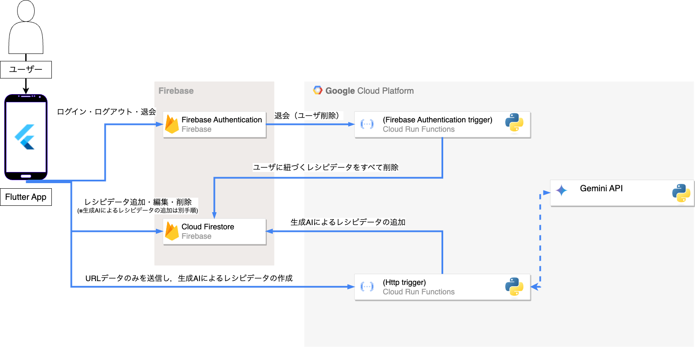

# Cook Helper

## 概要

- 自身のオリジナルまたは好みのwebサイトのレシピを登録・管理するモバイルアプリです．
- webサイトのレシピを登録する際，URLのみ入力し，料理名や材料・作り方に関しては，生成AIに自動抽出してもらうこともできます．

## 動作例

## 経緯・意図

## 経緯1：レシピをすぐに確認できるようにしたい．
私自身，自炊をする際，Youtubeや料理サイトで公開されているレシピを参考にすることが多いです．ですが，一度参考にしたレシピをまた調理する際，再度ブラウザやyoutubeで調べて調理手順や材料を逐一確認することがよくあります．この手間の解消をするため，最初は普通のノートに材料や手順を書いていたのですが，これもだんだん面倒になってきました．こういった手間や面倒さの解消が経緯の1つです．

## 経緯2：マンネリ化
経緯1の方で述べた手間や面倒さが理由で，自炊する料理のレパートリーがマンネリ化していきました．具体的には，作る料理が特定のものに限るようになりました．「登録したレシピ群から，ランダムにレシピを決めてくれる機能」をアプリに組み込んでいるのも，このマンネリ化が背景にあります．

## なぜ，手動によるWebサイトレシピ登録機能を加えたのか？

この機能の目的は，正確な情報をユーザ側に入力してもらうようにさせるためです．生成AIによるwebサイトレシピ情報の自動抽出・生成も機能として予定してますが，生成された情報が完璧とは言えません．ユーザ側にコピペ等で情報を抽出してもらえば，正確な情報を保管・管理することができます．

## 主な機能
- レシピ登録．レシピ登録にする際は，下記3種類のレシピを登録できます．レシピ登録画面では，種類に応じて入力が必要な情報の種類・数が変わります．

| レシピ | 入力項目 | 詳細 |
|---|---|---|
| オリジナルレシピ | 料理名，材料，作り方 |  |
| Webサイトレシピ（手動入力）| 料理名，材料，作り方, URL |  |
| Webサイトレシピ（AI自動生成）| URLのみ | URLから，生成AIがレシピ情報を抽出してくれます．|

- Share Extension・Intentによるレシピ登録：アプリの外側（Youtubeアプリやブラウザ）から，共有ボタンを通して，アプリにURLデータを転送します．その後，生成AIを利用して，Webサイトのレシピを自動生成・登録します．

- レシピ編集
- レシピ削除
- おまかせレシピ：登録したレシピの中からランダムにレシピを決めてくれる．

## 使用技術

| カテゴリ | 技術 | 詳細 |
|---|---|---|
|モバイルアプリ|Flutter，Dart||
| 認証 | Firebase Authentication| ユーザ管理．メールとパスワードでの認証 |
|データベース | Firebase Firestore | 登録したレシピを管理 |
| 生成AI | Gemini API | URLからレシピ情報を生成する時に用いる |
|その他バックエンド |Cloud Run functions (Python3) |①ユーザが削除された際にそのユーザに紐づくレシピデータを削除する．②生成AIを用いてURLからレシピ情報を自動生成し，Firestoreへ追加する．|

